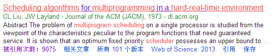
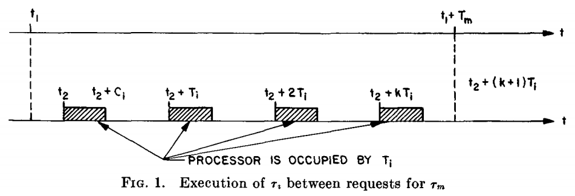
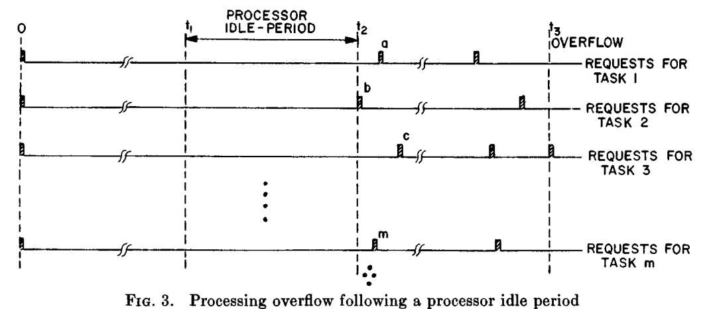

 
#
<element style="margin:0em 0px 12px; padding:0px; font-family:Microsoft YaHei;   color:rgb(32,136,178); line-height:32px">Scheduling Algorithms for Multiprogramming in a Hard-Real-Time Environment</element>


##<element style="margin:0em 0px 12px; padding:0px; font-family:Microsoft YaHei;   color:rgb(32,136,178); line-height:32px">感想</element>

&nbsp;&nbsp;&nbsp;&nbsp;&nbsp;&nbsp;题目可以翻译为“硬实时环境下多程序的调度算法”，发表于1973年，引用情况如下图，文章推导了很多针对硬实时调度算法的定理，如最优静态调度算法RM、RM调度算法最小资源使用率上界……这些定理堪称实时调度算法的经典。由于当时还没有多核多处理器的概念，所以文章推导的公式都是针对单处理器的。


  

&nbsp;&nbsp;&nbsp;&nbsp;&nbsp;&nbsp;文章首先对系统做了一些假设（待会会介绍），然后以这些假设为前提进行推导。看完这篇文章，我有以下几点感触或者疑惑：
1. 文章中任务$τ_i$的资源利用因子：$u_i=C_i/T_i$，其中$C_i$为任务$τ_i$的计算时间，$T_i$为任务$τ_i$的周期，系统的使用率为各个任务的使用率之和，即$U=\sum_{τ=1}^m(C_i/T_i)$。假如将其拓展到MapReduce模型中，任务使用率子怎么算$u_i=u_{map}+u_{reduce}=C_{map}/T_i+C_{reduce}/T_i$还是？
2. RM调度算法：周期越短，任务的优先级越高。该算法为最优静态调度算法，静态调度算法，即任务的优先级一旦确定，以后不能被改变。存在另外一种调度算法：动态调度算法，即任务的优先级不是固定的。文章中的deadline-driven scheduling algorithm是一种动态调度算法，该调度算法的思想：任务的优先级根据其截止时间调整，截止期越近的任务优先级越高，即EDF调度算法。
3. 针对文章中提出的任务集，EDF调度算法可以让所有$U<=1$的任务都被调度，而RM调度算法没法保证。但是当$U>1$时，如果以成功率为衡量指标，则RM调度算法的性能可能会更好。
4. 文章中的定理比较经典，需要注意，其适用范围是在那几个假设基础上推导的，在生产环境中，部分权重需要修正。
5. 定理的证明思路：反证法、推出特殊例子，在推导使用率最小上界时，找出使用率最差的任务集，并且让周期最长的任务的计算时间最长。

##<element style="margin:0em 0px 12px; padding:0px; font-family:Microsoft YaHei;  color:rgb(32,136,178); line-height:32px">摘要</element>

&nbsp;&nbsp;&nbsp;&nbsp;&nbsp;&nbsp;处理器上多任务的调度可以看作是一个用来满足任务服务质量需求的函数。当任务集很大时，如果采用最优静态调度算法，处理器的最小使用率上界可能只有70%。而如果采用动态分配优先级的方法，可以让处理器的使用率达到100%。最后，本文设计了一种将这两种调度思想混合在一起形成的调度算法，并分析了其性能


##<element style="margin:0em 0px 12px; padding:0px; font-family:Microsoft YaHei;   color:rgb(32,136,178); line-height:32px">引言</element>
##<element style="margin:0em 0px 12px; padding:0px; font-family:Microsoft YaHei;   color:rgb(32,136,178); line-height:32px">背景</element>
##<element style="margin:0em 0px 12px; padding:0px; font-family:Microsoft YaHei; font-size:22px; color:rgb(32,136,178); line-height:32px">系统环境</element>
&nbsp;&nbsp;&nbsp;&nbsp;&nbsp;&nbsp;为了分析硬实时环境下程序的行为，必须对环境做必要的假设。这些假设不一定要完全满足，后面也将分析如果不满足这些假设，系统会变成什么样子。
1. 硬实时任务的请求是周期性的，即同一个任务，其任务间的间隔是固定的；
2. 任务必须在下一个任务的来临前得到响应；
3. 任务是相互独立的，任务的请求不依赖于其他任务的初始化或者完成情况；
4. 每一个任务的运行时间是恒定的。任务的运行时间是指任务在处理器上运行的时间，不算被中断的那段时间；
5. 系统中任何非周期性任务都是个别的，当他们运行时，会占用处理器，但是他们没有实时性要求。  

&nbsp;&nbsp;&nbsp;&nbsp;&nbsp;&nbsp;文章中有几个概念需要理解：
1. 静态优先级调度算法：任务间的优先级是固定的；
2. 动态优先级调度算法：运行过程中，任务的优先级可能发生变化
3. 混合调度算法：部分任务的优先级是固定的，其余的任务的优先级是动态调整的。

##<element style="margin:0em 0px 12px; padding:0px; font-family:Microsoft YaHei;   color:rgb(32,136,178); line-height:32px">固定优先级调度算法</element>
先解释几个概念：
1. overflow：t时刻，任务的截止时间到来，但是该任务没有执行完
2. feasible：调度算法是feasible，表示没有overflow发生，即任务的服务质量都得到了满足
3. response time：响应时间和请求时间间的时间间隔
4. a critical instant：该时刻，任务的response time将会最大
5. a critical time zone：任务在critical time时的response time

**<element style="margin:0em 0px 12px; padding:0px; font-family:Microsoft YaHei; color:rgb(32,136,178); line-height:32px">定理1</element>** 如果任务请求时，所有优先级更高的任务也发生请求，该时刻为任务的a critical instant  
证明思路：任务集合为$τ_1,τ_2,\cdots,τ_m$，$τ_m$的优先级最低。以$τ_m$为例，其他任务的请求时间在$t_2,t_2+T_i,t_2+2T_i+,\cdots,t2+kT_i$，如果$τ_m$在$t_2$处提交，其response time 一定大于在$t_1$时刻提交的。其他任务的证明过程类似。

**<element style="margin:0em 0px 12px; padding:0px; font-family:Microsoft YaHei; color:rgb(32,136,178); line-height:32px">定理2</element>** 针对某一任务集，如果存在某静态调度算法让该任务集顺利执行，则RM调度算法也可以满足该任务集的服务质量需求  
证明思路：任务集合为任务集合为$τ_i,τ_2,...,τ_m$，$τ_i$、$τ_j$是其中的两个任务，且$τ_i$的优先级更高，如果$T_i>T_j$，不难证明，$τ_j$的优先级更高时，该任务集也是可以调度的。既然RM调度算法的任务优先级顺序可以从任何调度算法中任务的优先级顺序变换而来，所以RM调度算法仍然让该任务集可以调度。即证明了定理2.

##<element style="margin:0em 0px 12px; padding:0px; font-family:Microsoft YaHei;  color:rgb(32,136,178); line-height:32px">处理器使用率界限</element>
使用率：
$$U=\sum_{i=1}^{m}(C_i/T_i)$$
任务集完全利用了处理器的资源，即该任务集的服务质量得到了满足，且增加任何一个任务的计算时间，该任务集都变得不可调度。
**<element style="margin:0em 0px 12px; padding:0px; font-family:Microsoft YaHei; color:rgb(32,136,178); line-height:32px">定理3</element>** 如果只有两个任务，那么利用率的最小上界是$U=2（2^{1/2}-1）$ 
证明思路：任务集$τ_1,τ_2$，$T_1 < T_2$，$C_1$已知，则$τ_1$的优先级更高，在$τ_2$的一个critical time zone区间里，$\lceil{T_2/T_1}\rceil$个$τ_1$会发出任务请求。文章分两种情况讨论：$τ_1$会在第二个$τ_2$请求前完成，$τ_1$在第二个$τ_2$请求前没法完成。均可证明利用率的最小上界为$U=2（2^{1/2}-1）$ 
**<element style="margin:0em 0px 12px; padding:0px; font-family:Microsoft YaHei; color:rgb(32,136,178); line-height:32px">定理4</element>** 对于给定的m个任务集，任务的优先级顺序固定，且任意两个任务的周期之比小于2，那么该任务集的最小利用率上界是$U=m（2^{1/m}-1）$  
证明思路：任务集$τ_1,τ_2,\cdots,τ_m$，且$T_1 < T_2 < \cdots < T_m$，文章首先证明下面情况下，处理器的利用率最低
$$
C_1=T_2-T_1\\
C_2=T_3-T_2\\
\vdots\\
C_{m-1}=T_m-T_m-1
$$
则$C_m=T_m-2(C_1+C_2+\cdots+C_{m-1})$，令$g_i=(T_m-T_i)/T_i$，则可以推出$U$和$g_i$之间的关系，当$\frac{\partial U}{\partial {g_i}}=0$时，处理器的利用率最低，这时$g_j=2^{(m-j)/m}-1,j=0,1,\cdots,m-1$，最后得到$U=m(2^{1/m}-1)$，即为处理器的最小利用率上界
**<element style="margin:0em 0px 12px; padding:0px; font-family:Microsoft YaHei; color:rgb(32,136,178); line-height:32px">定理5</element>** 对于给定的m个任务集，如果采用固定优先级调度算法，该任务集的最小利用率上界是$U=m（2^{1/m}-1）$  
证明思路：当存在两个任务的周期之比大于等于2时。可以假定$T_m=qT_i+r,q>1,r\geq0$。用$τ_i^{,}$替代$τ_i$，$T_i^{,}=qT_i,C_i^{,}=C_i$，同时增加$C_m$，使得任务集可以完全利用处理器的资源。$C_m$最多可以增加$C_i(q-1)$,则
$$
U^，\leq U+C_i(q-1)[1/(qT_i+r)-(1/qT_i)]
$$
由于$q-1>0,[1/(qT_i+r)]-(1/qT_i)\leq 0,U^,\leq U$。因此我们考虑任务集的使用率最小上界时，只需考虑任务集中任务的周期之比小于2的情况。
##<element style="margin:0em 0px 12px; padding:0px; font-family:Microsoft YaHei;  color:rgb(32,136,178); line-height:32px">Relaxing the Utilization Bound</element>
##<element style="margin:0em 0px 12px; padding:0px; font-family:Microsoft YaHei;  color:rgb(32,136,178); line-height:32px">截止时间驱动调度算法</element>
**截止时间驱动调度算法**：任务的截止时间越短，优先级越高，即EDF调度算法。该算法中，任务间的优先级顺序是动态变化的。
**<element style="margin:0em 0px 12px; padding:0px; font-family:Microsoft YaHei; color:rgb(32,136,178); line-height:32px">定理6</element>** 当用EDF调度算法调度是，在overflow之前，处理器是不会有空闲时间的。  
证明思路：如果在overflow之前存在空闲时间，假设该空闲时间是$t_1$到$t_2$，overflow时刻是$t_3$，如果将$τ_1$移动到$t_2$,由于$t_2$和$t_3$之间处理器没有空闲时间，所以移动到$t_2$时刻，也不会出现处理器空闲的情况。将其他任务移动到$t_2$时刻，也不会出现处理器空闲的时刻，而$t_3$前，会出现overflow。和假设”任务overflow之前会存在空闲时间“相违背（证毕）。

**<element style="margin:0em 0px 12px; padding:0px; font-family:Microsoft YaHei; color:rgb(32,136,178); line-height:32px">定理7</element>** 任务集大小为m，EDF调度算法能满足服务需求的充要条件：
$$
(C_1/T_1)+(C_2/T_2)+…+(C_m/T_m)\leq 1.
$$
##<element style="margin:0em 0px 12px; padding:0px; font-family:Microsoft YaHei;  color:rgb(32,136,178); line-height:32px">混合调度算法</element>
**定义** 让任务1,2,...,k 采用RM调度算法，在这k个任务的需求得到满足的情况下，任务k+1,k+2,...,m采用EDF调度算法
a(t)为t的单调增函数。如果$a(T)\leq a(t+T)-a(t)$，则$a(t)$是sublinear的。t时刻前，处理器的计算时间可以用a(t)表示。$a_k(t)$表示任务k+1,k+2,...,m可以利用的处理器时间。
**<element style="margin:0em 0px 12px; padding:0px; font-family:Microsoft YaHei; color:rgb(32,136,178); line-height:32px">定理8</element>** 如果采用EDF调度算法的任务集，其处理器上可用的时间$a(t)$是sublinear的，那么在overflow之前是处理器是没有空闲时间的。  
**<element style="margin:0em 0px 12px; padding:0px; font-family:Microsoft YaHei; color:rgb(32,136,178); line-height:32px">定理9</element>** 对于采用EDF调度算法的任务，任务可以调度的充要条件是：任务的计算时间、周期以及这些任务可用的处理器时间之间的关系应满足
$$
\left\lfloor t/T_{k+1}\right\rfloor C_{k+1}+\left\lfloor t/T_{k+2}\right\rfloor C_{k+2}+\cdots+\left\lfloor t/T_{m}\right\rfloor C_{m}\leq a_k(t)
$$  
对所有$T_{k+1},or T_{k+2},\cdots,T_m$的整数倍的时刻均成立
**推论1**：三个任务$τ_1、τ_2、τ_3$，$T_1$最小，其中$τ_1$采用固定优先级任务调度算法，$τ_1、τ_2$采用EDF调度算法，如果满足下式，则任务是可调度的
$$
1-(C_1/T_1)-min[(T_1-C_1)/T_2,(C_1/T_1)]\geq (C_2/T_2)+(C_3/T_3)\\
or\\
C_2\leq a_1(T_2),\left\lfloor T_3/T_2\right\rfloor C_2+C_3\leq a_1(\left\lfloor T_3/T_2\right\rfloor T_2),and (\left\lfloor T_3/T_2\right\rfloor +1)C_2+C_3\leq a_1(T_3)
$$
##<element style="margin:0em 0px 12px; padding:0px; font-family:Microsoft YaHei;  color:rgb(32,136,178); line-height:32px">比较和注解</element>
定理9表明，采用混合调度算法的任务集的利用率没法达到100%。举个简单的例子，有三个任务，$T_1=3,T_2=4,T_3=5$，且$C_1=C_2=1$，如果采用混合调度策略，因为$a_1(20)=13$，可以推出$C_3$最大可以达到2，处理器的使用率为
$$
U=\frac{1}{3}+\frac{1}{4}+\frac{2}{5}=98.3\%.
$$
如果采用EDF调度算法，$C_3$可以达到$2.0833\cdots$，处理器的利用率可以达到100%。
如果采用RM调度算法，$C_3$只能达到1，
$$
U=\frac{1}{3}+\frac{1}{4}+\frac{1}{5}=78.3\%.
$$
只比三个任务的最小利用率上界大一点。
尽管混合调度算法的任务界限没有找到，但是其利用率明显高于采用RM调度算法的任务集的利用率，因此混合调度策略可能在很多场合能被使用到
